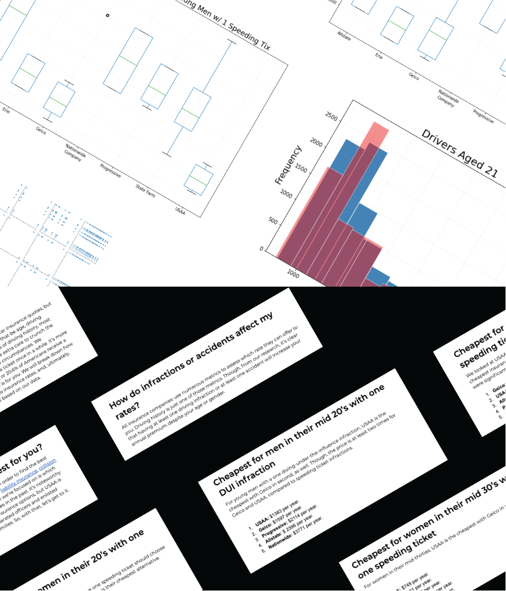

# Data Analysis and Writing

## Project overview

The task was to interpret the data using any methods I preferred and use this analysis to write an article that would be valuable to the general public. As the submission of this work was intended for writers with little to no working knowledge of Python, Jupyter notebooks or data-science, I created an easily deployable cloud-based notebook using Binder. 

## Contributions

Using Python and associated data science libraries, I explored the data and generated some useful conclusions. Numpy, Matplot, Seaborn, and a few other libraries were used for my data exploration and plot generation. Then, after the analysis was complete, I selected which conclusions that were drawn from the data would be most useful to a wide reader base. Finally, I incorporated these conclusions into a written piece using a conversational style that provided suggestions for the cheapest insurance for customers with a single speeding ticket.

<a href="https://mybinder.org/v2/gh/typride/Data-Analysis-Car-Insurance/master" class="btn btn-primary">View the Jupyter Notebook</a>

