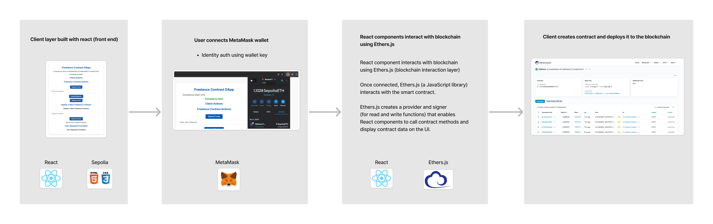
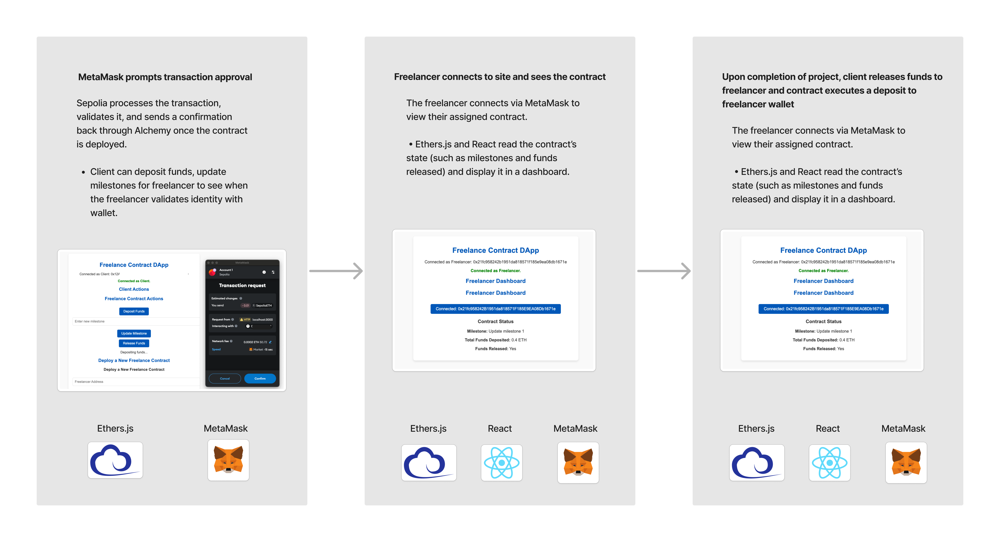

# Freelance Payment Platform with Smart Contracts

This project is a decentralized freelance contract platform that enables clients to create, deploy, and manage custom contracts on the Ethereum blockchain with full transparency. Using a factory contract, clients can initiate smart contracts with freelancers, secure funds in escrow, and handle milestones and payment releases automatically. The React frontend integrates seamlessly with MetaMask, allowing users to connect wallets, initiate and track contracts, and ensure payment flows securely and transparently. Designed for efficient collaboration, the DApp demonstrates expertise in Solidity, Ethereum, and decentralized finance solutions.

## Technologies used

<table>
    <thead>
        <tr>
            <th>Technology</th>
            <th>Purpose</th>
            <th>Role</th>
        </tr>
    </thead>
    <tbody>
        <tr>
            <td>Solidity</td>
            <td>Smart contract development</td>
            <td>Core business logic on Ethereum</td>
        </tr>
        <tr>
            <td>Hardhat</td>
            <td>Development and testing</td>
            <td>Compile, test, and deploy contracts</td>
        </tr>
        <tr>
            <td>Ethers.js</td>
            <td>Blockchain interaction in frontend</td>
            <td>Connect frontend to Ethereum</td>
        </tr>
        <tr>
            <td>MetaMask</td>
            <td>Wallet connection</td>
            <td>Manage accounts and approve transactions</td>
        </tr>
        <tr>
            <td>React</td>
            <td>Frontend framework</td>
            <td>Build dynamic UI for the DApp</td>
        </tr>
        <tr>
            <td>JavaScript & Node.js</td>
            <td>General programming & scripting</td>
            <td>Backend and frontend logic</td>
        </tr>
        <tr>
            <td>Alchemy</td>
            <td>Ethereum node provider</td>
            <td>Access Sepolia network</td>
        </tr>
        <tr>
            <td>Sepolia</td>
            <td>Ethereum test network</td>
            <td>Safe testing environment</td>
        </tr>
        <tr>
            <td>HTML & CSS</td>
            <td>Basic structure and styling</td>
            <td>UI layout and appearance</td>
        </tr>
    </tbody>
</table>

## User flow & tech used

